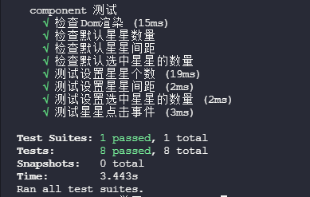

# 评分组件

    
    

>A UI component for rate
>
>用于常规用户评分

------

### 一、使用示例

 

### 二、组件功能

- 可记录用户点击评分分数
- 可传入默认评分分数
- 可设置评分星星个数
- 可配置星星之间的间距

### 三、组件参数及事件

**参数**

| 参数         | 说明           | 类型   | 默认值 |
| ------------ | -------------- | ------ | ------ |
| count        | 评分的星星数量 | Number | 5      |
| defalutValue | 默认评分       | Number | 0      |
| space        | 星星间距       | Number | 5      |

**方法**

**onChange(data)**  :监听评分变化事件，data为评分分值。

### 四、使用方法

- 1、安装依赖

  `npm set registry http://npm.flyui.cn  `
  `npm install @edu/ui-rate-star`

- 2 、页面引用

  `import  from '@edu/ui-rate-star'`

  <template>
    <ui-rate-star :count="10" :defalutValue="4" :space="20" @onChange="getStar"></ui-rate-star>
  </template>

### 五、版本更新日志

**日志**

| Version | Description |
| ------- | ----------- |
| 1.0.0   | 评分组件    |

### 六、组件测试结果

V1.0.0

